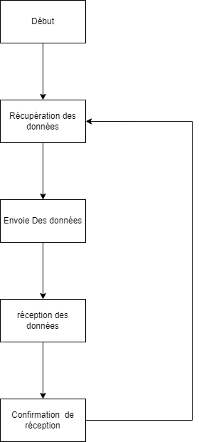
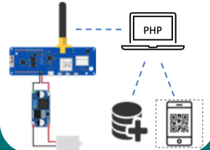

<p align="center">

</p>

## Bagaway - VPE ECE 2022

BagAway est un service open source qui propose de venir récupérer vos affaires sur place et de les garder​dans un véhicule privé sécurisé. Nous gardons vos affaires encombrantes (étudiants, touristes)​et vous les rendons quand et où vous le désirer. Service sous la forme d’une application qui se​base sur un algorithme d’optimisation de déplacement.

## Membre de l'equipe :

Zakaria Tozy <br>
email : Zakaria.tozy@edu.ece.fr <br>

Matthieu Sajot <br>
email : Matthieu.sajot@edu.ece.fr <br>

Etienne Lionnet <br>
email : Etienne.Lionnet@edu.ece.fr <br>

Tom Siennicki <br>
email : Tom.Siennicki@edu.ece.fr <br>

Alexandre Baptista <br>
email : Alexandre.Baptista@edu.ece.fr <br>

Arthur Auffray<br>
email : Arthur.Auffray@edu.ece.fr <br>


## Contenu du GitHub

### 1. Objectif :
L'objectif est de créer une plateforme open source pour gerer des reservations entre le client et notre service pour récupérer des affaires encombrantes et les rendre plus tard. Cette plateforme devra s'adapter à une logistique particulière.


### 2. Methode :  

Notre méthodologie consiste à développer un site web qui permet aux utilisateurs de réserver un casier et de visualiser les déplacement de leurs affaires. Cette partie est développée en PHP et SQL pour le backend en s’appuyant sur les logiciels MySQL et WAMP. Pour le front nous avons utilisé html ccs et Bootstrap.​

D’autre part pour la partie hardware nous avons programmé un Esp32(LILYGO® TTGO) qui nous permet à la fois de récupérer la position du casier et de transmettre les informations utiles au PHP. Nous avons également utilisé l’IDE Arduino et le langage C pour coder L’esp.​

<p align="center">

</p>

### 3. Shema du circuit

<p align="center">

</p>

### 4. Build Docker image of your application
- Docker is a set of platform as a service (PaaS) products that use OS-level virtualization to deliver software in packages called containers.<br>

- We created an image of our application using docker :
```
docker build -t devopszak .
```


- We get see our docker image using : <br>
```
docker images
```


- We can run our images using : <br>
```
docker run -dp 3000:3000  devopszak
```
- We get acces to it at  : <br>
```
127.0.0.1:3000
```


- Now we push the image of our application in the dockerhub https://hub.docker.com/, but before that we need to configure a .dockerignore file to avoid pushing not necessary files <br>

- We tag our image and after we push it : <br>
```
docker tag devopszak  zack242/devopszak
docker push zack242/devopszak
```
- Now we can find it on the dockerhub.<br>


### 5. Make container orchestration using Docker Compose

- Compose is an orchestration tool that makes spinning up multi-container distributed applications with Docker.

- We add a file docker-compose.yaml for the container orchestration and using the following command to run it : <br>
```
docker-compose up
```


And like for the docker image we can get acces to our application :
```
127.0.0.1:3000
```


### 6. Make docker orchestration using Kubernetes

- Kubernetes is an open-source container-orchestration system for automating computer application deployment, scaling, and management. <br> <br>

- We implement a new folder call k8s where we set our Manifest yaml files
(deployment.yaml and our services.yaml).After we use the following command to start minikube and apply our manifest files to our cluster : <br>

```
minikube start
kubectl apply -f deployment.yaml
kubectl apply -f services.yaml
kubectl get pods
```

- We see the following pods running thanks to the commande kubectl get pods : <br>


- With the following comande :
```
minikube service userapi

minikube ip
```
- We expose our Kubernetes service to the outside :


And on the host :
```
192.168.99.101:31406
```
- We can find our application running :


- We also setup 2 different persistent volume :

- PersistentVolume (PV) - a piece of storage in the cluster that has been provisioned by an administrator. It has a life cycle independent of any individual Pod that uses the PV.

- PersistentVolumeClaim (PVC) - a request for storage by a user.

- We apply this volume configuration to the pods of our deployment.

### 7. Make a service mesh using Istio

- Istio is an open source service mesh that layers transparently onto existing distributed applications.

- We deploy your application using Istio :


- We didn't get 2 version of our app, for this we used the samples of the lab to the trafing-shifting and the route-request.

### 8. Implement Monitoring to your containerized application

- Install Prometheus and Grafana to your K8s cluster

```
kubectl apply -f samples/addons
```


```
kubectl rollout status deployment/kiali -n istio-system
```


- Sadly we didin't get acces to the grafana or Prometheus dashboard.
